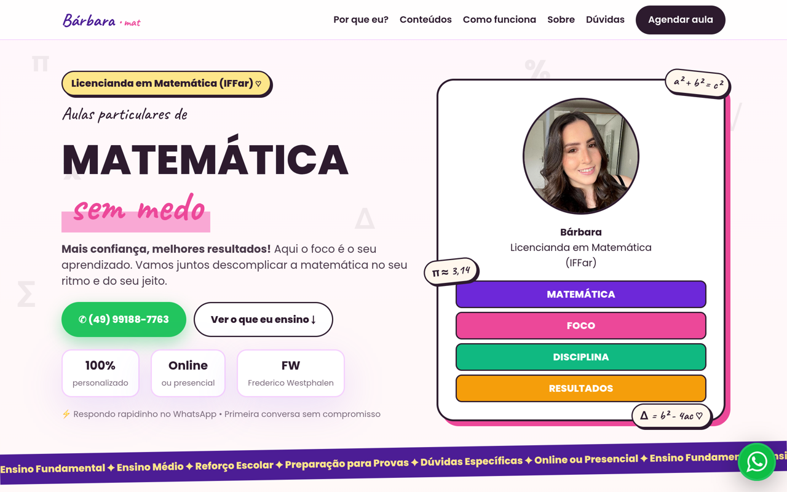
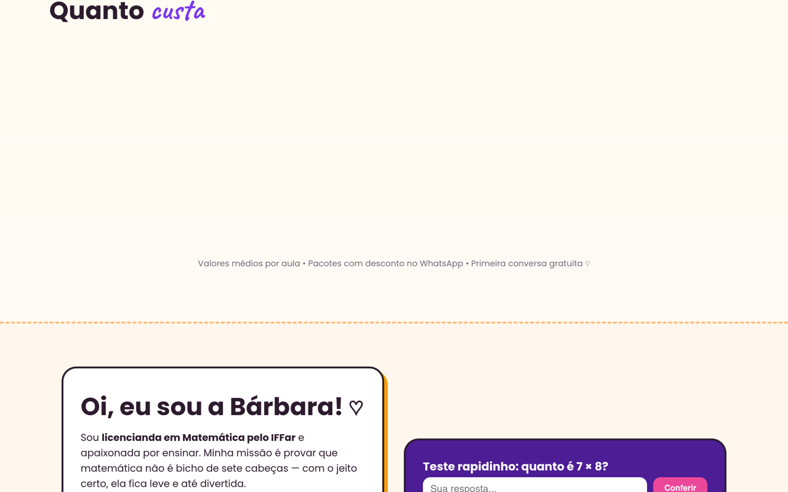
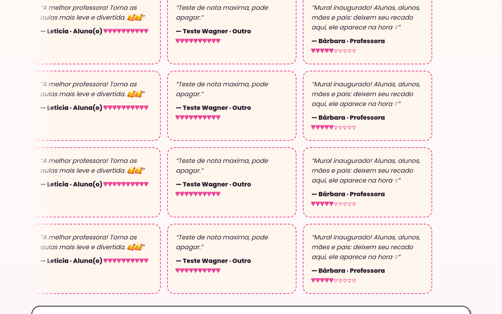

# 📓 Caderno da Bárbara — Matemática sem medo

> *"Aqui o foco é o seu aprendizado. Vamos juntos descomplicar a matemática no seu ritmo e do seu jeito."* — Bárbara

[](https://barbara-matematica.vercel.app)

<a href="https://barbara-matematica.vercel.app"></a>

## Boletim do site 📝

| Matéria | Nota | Observação da professora |
|---|---|---|
| Landing page | A+ | Hero, benefícios, preços, FAQ e CTA de WhatsApp |
| Mural de recados | A+ | Alunas escrevem sem conta e aparece na hora (Realtime) |
| Painel admin | A+ | Ela edita telefone, preços e foto sozinha, com login |
| Responsivo | A+ | Do celular da mãe ao PC da escola |

**Média final:** aprovado com louvor. 🎓

## Colagem ✂️

**Como funciona + quanto custa:**
<a href="https://barbara-matematica.vercel.app"></a>

**O mural em funcionamento (recados entrando na hora):**
<a href="https://barbara-matematica.vercel.app"></a>

## Bilhetes (como funciona)

- **Mural:** projeto grátis no Supabase → rodar `supabase-mural.sql` → colar `URL` + `anon` em `supabase-config.js`. Pronto, recado entra no carrossel sozinho.
- **Painel:** rodar `supabase-site.sql` → criar a usuária dela em Authentication → entregar o link do `/admin.html`.
- **Preços de hoje:** online R$45 · presencial R$50 (em `#precos` e no FAQ).

## Matéria dada (estrutura)

`index.html` (a aula) · `admin.html` (a sala dos professores) · `styles.css` (rosa + lilás, Caveat + Poppins) · `mural.js` (o correio) · `supabase-*.sql` (o arquivo).

## Material escolar 🎒

<div align="center">
  
</div>

Sem build, sem framework. Realtime e Auth do Supabase.

## Lição de casa

```bash
git clone https://github.com/Wagner-Schemmer/aulas-barbara-matematica.git
cd aulas-barbara-matematica && python3 -m http.server 8000
```

---
Passado a limpo por [Wagner Schemmer](https://wagner-port.vercel.app) · [Portfólio](https://wagner-port.vercel.app) · [LinkedIn](https://www.linkedin.com/in/wagner-schemmer-martins-46950627a)
